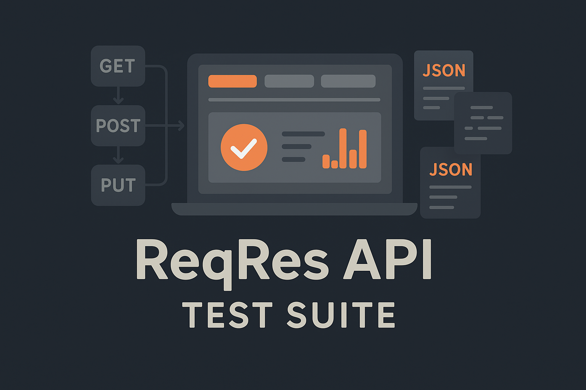

<h1 align="center">ReqRes API – Complete Testing Suite</h1>

  

  A complete automated test suite for the public ReqRes API, designed to validate CRUD operations, response integrity, and system resilience.
  Built entirely in Postman with reusable scripts, assertions, and environments to simulate real-world API testing scenarios.

<h2 id="about">About The Project</h2>

  The <strong>ReqRes API – Complete Testing Suite</strong> is a professional-quality Postman collection created to demonstrate advanced skills in API testing and automation.
  It validates the functionality, reliability, and performance of the ReqRes API through structured test cases, including CRUD operations, response time checks, and idempotency validation.
  Designed as a portfolio-ready testing suite, it reflects best practices in automated API testing and reporting using <strong>Postman</strong> and <strong>Newman</strong>.

  <h3>Built With</h3>
  
  
  
  

<h2 id="requirements">Requirements</h2>

Make sure you have the following installed:

<pre><code>
Postman (latest version)
Node.js >= 18
npm
Newman CLI (for automated runs)
</code></pre>

<h2 id="installation">Installation</h2>
<ol>
  <li>Clone or download this repository:
    <pre><code>git clone https://github.com/PortillaXpert/ReqRes-API-Testing-Suite.git</code></pre>
  </li>
  <li>Import the collection into Postman:
    <pre><code>File → Import → 01_-_ReqRes_API_Testing.postman_collection.json</code></pre>
  </li>
  <li>(Optional) Import the environment:
    <pre><code>File → Import → ReqRes_Production.postman_environment.json</code></pre>
  </li>
</ol>

<h2 id="usage">Usage</h2>

To execute the collection locally using <strong>Newman</strong>:

<pre><code>
newman run 01_-_ReqRes_API_Testing.postman_collection.json -e ReqRes_Production.postman_environment.json
</code></pre>

This will run all automated tests, including:

<ul>
  <li>Response status validation (2xx, 4xx, 5xx)</li>
  <li>Data integrity checks</li>
  <li>Performance and response time assertions</li>
  <li>Idempotency verification for DELETE operations</li>
  <li>Security header presence checks</li>
</ul>

<h2 id="features">Features</h2>
<ul>
  <li>Comprehensive CRUD operation coverage</li>
  <li>Automatic validation of status codes and response bodies</li>
  <li>Dynamic environment variables and chained requests</li>
  <li>Performance assertions for acceptable response times</li>
  <li>Post-request validations ensuring data consistency</li>
  <li>Ready-to-execute via Newman CLI for CI/CD pipelines</li>
</ul>

<h2 id="collection-structure">Collection Structure</h2>
<ul>
  <li><strong>Users:</strong> Tests for user creation, retrieval, update, and deletion</li>
  <li><strong>Global Tests:</strong> Shared pre-request and post-request scripts</li>
  <li><strong>Assertions:</strong> Performance, JSON schema, and security validations</li>
</ul>

<h2 id="contributing">Contributing</h2>

Contributions are welcome! Here's how to start:

<ol>
  <li>Fork the repository</li>
  <li>Create a new branch:
    <pre><code>git checkout -b feature/feature-name</code></pre>
  </li>
  <li>Commit your changes:
    <pre><code>git commit -m "Add your feature"</code></pre>
  </li>
  <li>Push the branch:
    <pre><code>git push origin feature/feature-name</code></pre>
  </li>
  <li>Open a Pull Request</li>
</ol>

<h2 id="license">License</h2>

This project is licensed under the MIT License. See <code>LICENSE</code> for more information.

<h2 id="contact">Contact</h2>

  Created by <a href="https://github.com/PortillaXpert" target="_blank">Juan Pablo Rivera Portilla</a> 
  Email: <a href="mailto:jrivera082002@gmail.com">jrivera082002@gmail.com</a>

  (<a href="#readme-top">Back to top</a>)

